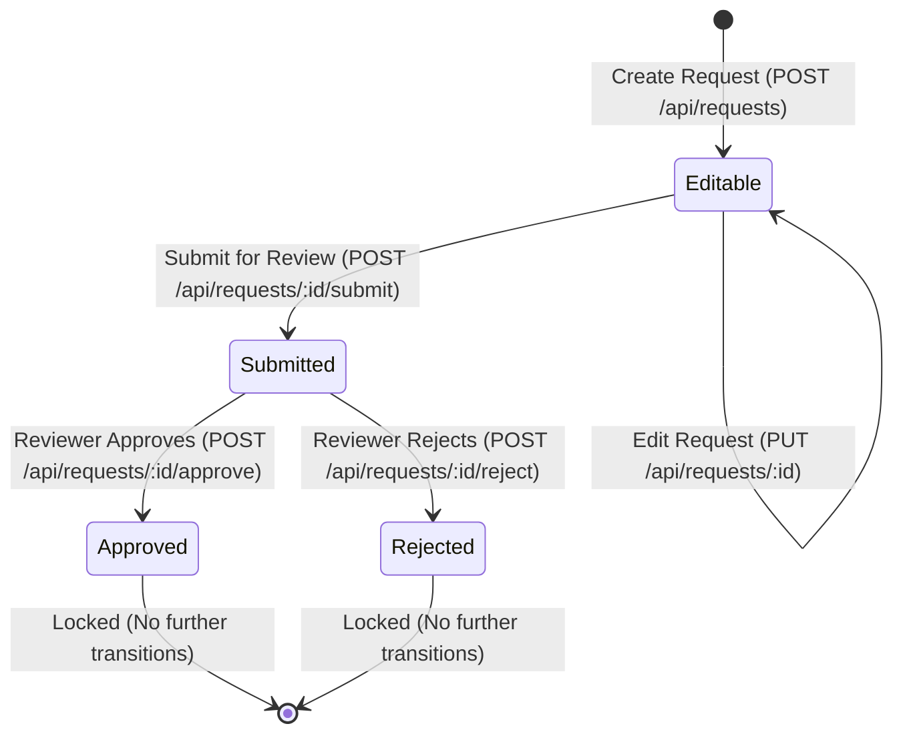

# ✦ ApprovalFlow — Approval Request Management System

<div align="center">

  [](https://approval-flow-sooty.vercel.app/requests)
  [](https://approval-flow-twdt.onrender.com/api/health)
  [](https://github.com/pushpanjali1909/Approval_Flow)
  [](https://github.com/pushpanjali1909/Approval_Flow)

  <br/>

  **A modern, production-ready Full-Stack Approval Request Application built with Node.js + Express, Angular 19, and in-memory storage.**

  [Explore Live App](https://approval-flow-sooty.vercel.app/requests) · [API Documentation](#-rest-api-documentation) · [Report Bug](https://github.com/pushpanjali1909/Approval_Flow/issues)

</div>

---

## 🌐 Live Deployments

| Service | Platform | Live URL | Status |
| :--- | :--- | :--- | :--- |
| **Frontend Web App** | **Vercel** | [https://approval-flow-sooty.vercel.app/requests](https://approval-flow-sooty.vercel.app/requests) |  |
| **Backend REST API** | **Render** | [https://approval-flow-twdt.onrender.com/api/health](https://approval-flow-twdt.onrender.com/api/health) |  |
| **GitHub Codebase** | **GitHub** | [https://github.com/pushpanjali1909/Approval_Flow](https://github.com/pushpanjali1909/Approval_Flow) |  |

---

## 🎨 UI/UX Design System

The application features a tailored **Celestial Periwinkle (`#C2D6F2`)** design language created with modern SaaS design standards:
- **Ambient Mesh Gradient Background**: Smooth multi-stop gradient based on `#C2D6F2` providing an airy, premium look.
- **Glassmorphism Components**: Translucent frosted panels (`backdrop-filter: blur(16px)`) with delicate periwinkle borders and elevation shadows.
- **Visual Status Hierarchy**:
  - `Editable`: Warm Honey Amber (`#fef3c7`)
  - `Submitted`: Celestial Soft Blue (`#dbeafe`)
  - `Approved`: Emerald Mint (`#dcfce7`)
  - `Rejected`: Rose Blush (`#fee2e2`)
- **Responsive Layout**: Designed for optimal viewing across desktop, tablet, and mobile devices.

---

## ⚡ Key Capabilities

- **Strict Server-Side State Machine**:
  - Enforces `Editable` → `Submitted` → `Approved` / `Rejected`.
  - Disallowed transitions and unauthorized edits trigger HTTP `409 Conflict`.
- **Server Calculation Integrity**:
  - Automatically calculates line item totals ($\text{quantity} \times \text{price}$) and grand total ($\sum \text{line totals}$).
  - Client-supplied totals are strictly untrusted and recalculated on the server.
- **Interactive Forms & Live Calculations**:
  - Dynamic line items (add/remove) with real-time total updates.
  - Validation guards ensuring title, requester, non-empty line items, and quantities/prices $> 0$.
- **Data Filtering & Pagination**:
  - Live search by request title.
  - Status filter dropdown (`All`, `Editable`, `Submitted`, `Approved`, `Rejected`).
  - Pagination controls (`Previous`, page numbers, `Next`) with item range indicators.
- **Contextual Actions & Confirmation Dialogs**:
  - Only allowed action buttons are visible based on current lifecycle status.
  - Confirmation modals before `Submit`, `Approve`, and `Reject` to prevent accidental actions.

---

## 🔄 State Machine & Business Rules



### Transition Rules Matrix

| Current State | Action | Target State | Result | HTTP Code |
| :--- | :--- | :--- | :--- | :--- |
| **Editable** | Update (`PUT`) | Editable | ✅ Allowed | `200 OK` |
| **Editable** | Submit | Submitted | ✅ Allowed | `200 OK` |
| **Editable** | Approve | Approved | ❌ Rejected | `409 Conflict` |
| **Editable** | Reject | Rejected | ❌ Rejected | `409 Conflict` |
| **Submitted** | Update (`PUT`) | — | ❌ Locked | `409 Conflict` |
| **Submitted** | Submit | — | ❌ Already Submitted | `409 Conflict` |
| **Submitted** | Approve | Approved | ✅ Allowed | `200 OK` |
| **Submitted** | Reject | Rejected | ✅ Allowed | `200 OK` |
| **Approved** | Any Action | — | ❌ Finalized | `409 Conflict` |
| **Rejected** | Any Action | — | ❌ Finalized | `409 Conflict` |

---

## 🛠️ Tech Stack

```
Frontend:              Backend:               DevOps & Storage:
├── Angular 19         ├── Node.js            ├── In-Memory Store (requests = [])
├── TypeScript         ├── Express.js         ├── Vercel (Frontend Hosting)
├── Standalone UI      ├── RESTful APIs       ├── Render (Backend Hosting)
└── CSS3 / Glassmorphism ├── Jest & Supertest  └── GitHub Version Control
```

---

## 📁 Architecture & Project Structure

```
Approval_Flow/
├── backend/
│   ├── src/
│   │   ├── controllers/
│   │   │   └── requestController.js    # Express route controller handlers
│   │   ├── routes/
│   │   │   └── requestRoutes.js        # REST endpoint mapping
│   │   ├── services/
│   │   │   └── requestService.js       # Business logic & state machine
│   │   ├── models/
│   │   │   └── requestModel.js         # Constants and status enums
│   │   ├── middleware/
│   │   │   ├── errorHandler.js         # Centralized error handling
│   │   │   └── validation.js           # Request payload validations
│   │   ├── utils/
│   │   │   ├── idGenerator.js          # Sequential REQ-XXX / LI-X generator
│   │   │   └── calculations.js         # Safe numeric financial math
│   │   ├── data/
│   │   │   └── store.js                # In-memory storage layer
│   │   └── server.js                   # Express server & CORS configuration
│   ├── tests/
│   │   └── requests.test.js            # 29 automated test cases (Jest)
│   └── package.json
│
├── frontend/
│   ├── src/
│   │   ├── app/
│   │   │   ├── models/
│   │   │   │   └── request.model.ts    # TypeScript interfaces
│   │   │   ├── services/
│   │   │   │   └── request.service.ts  # HTTP client service & error mapper
│   │   │   ├── components/
│   │   │   │   ├── request-list/       # List, search, filter, pagination
│   │   │   │   ├── request-form/       # Create & edit requests with live math
│   │   │   │   ├── request-detail/     # Details view & contextual actions
│   │   │   │   └── confirmation-modal/ # Reusable confirmation dialog
│   │   │   ├── app.routes.ts           # Angular route configurations
│   │   │   ├── app.component.ts        # Shell layout & navbar
│   │   │   └── app.config.ts           # Providers (HttpClient, Router)
│   │   ├── environments/
│   │   │   ├── environment.ts          # Local dev API configuration
│   │   │   └── environment.prod.ts     # Live Render production API configuration
│   │   ├── index.html                  # HTML entry point with app title
│   │   └── styles.css                  # Global design system & theme
│   ├── angular.json
│   ├── vercel.json                     # SPA routing rewrites for Vercel
│   └── package.json
│
├── vercel.json                         # Monorepo Vercel configuration
├── .gitignore
└── README.md
```

---

## 📖 REST API Documentation

Base Production URL: `https://approval-flow-twdt.onrender.com/api`  
Base Local URL: `http://localhost:3000/api`

### 1. Health Check
- **`GET /health`**
- **Response `200 OK`**:
  ```json
  {
    "status": "UP",
    "timestamp": "2026-09-20T06:25:27.215Z"
  }
  ```

### 2. Create Request
- **`POST /requests`**
- **Payload**:
  ```json
  {
    "title": "Office Equipment",
    "requester": "John Doe",
    "lineItems": [
      { "description": "Laptop", "quantity": 2, "price": 50000 },
      { "description": "Mouse", "quantity": 2, "price": 1000 }
    ]
  }
  ```
- **Response `201 Created`**:
  ```json
  {
    "id": "REQ-001",
    "title": "Office Equipment",
    "requester": "John Doe",
    "lineItems": [
      { "id": "LI-1", "description": "Laptop", "quantity": 2, "price": 50000, "total": 100000 },
      { "id": "LI-2", "description": "Mouse", "quantity": 2, "price": 1000, "total": 2000 }
    ],
    "grandTotal": 102000,
    "status": "Editable",
    "createdAt": "2026-09-20T05:00:00.000Z",
    "updatedAt": "2026-09-20T05:00:00.000Z"
  }
  ```
- **Errors**: `400 Bad Request` with validation error details.

### 3. List Requests (with Search, Status Filter & Pagination)
- **`GET /requests?search=Office&status=Editable&page=1&limit=10`**
- **Response `200 OK`**:
  ```json
  {
    "data": [ ... ],
    "pagination": {
      "page": 1,
      "limit": 10,
      "totalItems": 1,
      "totalPages": 1
    }
  }
  ```

### 4. Get Single Request
- **`GET /requests/:id`**
- **Response `200 OK`**: Complete request details.
- **Errors**: `404 Not Found` if ID does not exist.

### 5. Update Request
- **`PUT /requests/:id`**
- Only allowed when `status === 'Editable'`. Recalculates all totals.
- **Errors**:
  - `409 Conflict`: If request is in `Submitted`, `Approved`, or `Rejected` status.
  - `400 Bad Request`: If validation fails.
  - `404 Not Found`: If ID does not exist.

### 6. Lifecycle Actions
- **Submit**: `POST /requests/:id/submit` (Transitions `Editable` → `Submitted`)
- **Approve**: `POST /requests/:id/approve` (Transitions `Submitted` → `Approved`)
- **Reject**: `POST /requests/:id/reject` (Transitions `Submitted` → `Rejected`)

---

## 🧪 Automated Testing

The backend includes a comprehensive Jest + Supertest test suite covering **100% of the core business rules and edge cases**.

```bash
cd backend
npm test
```

### Test Suite Results:
```text
PASS tests/requests.test.js
  Approval Request Backend API
    1. Request Creation & Input Validation (POST /api/requests)
      ✓ Should create a valid request with server-calculated totals
      ✓ Should reject request without title (Case 1)
      ✓ Should reject request with empty title (Case 1)
      ✓ Should reject request without requester (Case 2)
      ✓ Should reject request without line items or empty line items array (Case 3)
      ✓ Should reject line item with missing description
      ✓ Should reject invalid quantity (0, negative, non-number) (Case 4)
      ✓ Should reject invalid price (0, negative, non-number) (Case 5)
      ✓ Should ignore client-supplied grandTotal and enforce server calculation
    2. State Transitions & Lifecycle Rules
      ✓ Should successfully submit an Editable request (Editable -> Submitted)
      ✓ Should reject submitting an already submitted request (Case 9: 409 Conflict)
      ✓ Should approve a submitted request (Submitted -> Approved)
      ✓ Should reject approving an Editable request (Case 7: 409 Conflict)
      ✓ Should reject approving an already Approved request (Case 10: 409 Conflict)
      ✓ Should reject approving a Rejected request (Case 12: 409 Conflict)
      ✓ Should reject a submitted request (Submitted -> Rejected)
      ✓ Should reject rejecting an Editable request (Case 8: 409 Conflict)
      ✓ Should reject rejecting an already Rejected request (Case 11: 409 Conflict)
      ✓ Should reject rejecting an already Approved request (409 Conflict)
    3. Editing Rules (PUT /api/requests/:id)
      ✓ Should allow editing an Editable request and recalculate totals
      ✓ Should reject editing a Submitted request (Case 6: 409 Conflict)
      ✓ Should reject editing an Approved request (409 Conflict)
      ✓ Should reject editing a Rejected request (409 Conflict)
    4. Retrieval, Search, Filter, Pagination, and Not Found Handling
      ✓ Should paginate results properly with page and limit
      ✓ Should search requests by title
      ✓ Should filter requests by status
      ✓ Should return empty array when search returns no results without server error (Case 14)
      ✓ Should return 404 for non-existent request ID (Case 13)
      ✓ Should get single request details successfully

Test Suites: 1 passed, 1 total
Tests:       29 passed, 29 total
Snapshots:   0 total
```

---

## 💻 Local Development Setup

### Prerequisites
- Node.js (v18+)
- npm (v9+)

### 1. Clone Repository
```bash
git clone https://github.com/pushpanjali1909/Approval_Flow.git
cd Approval_Flow
```

### 2. Start Backend Server
```bash
cd backend
npm install
node src/server.js
```
*(Backend runs on `http://localhost:3000`)*

### 3. Start Frontend App (In a new terminal)
```bash
cd frontend
npm install
npm.cmd start
```
*(Frontend runs on `http://localhost:4200`)*

---

<div align="center">

  Crafted with care by **Pushpanjali Bajpai** · [GitHub](https://github.com/pushpanjali1909)

</div>
